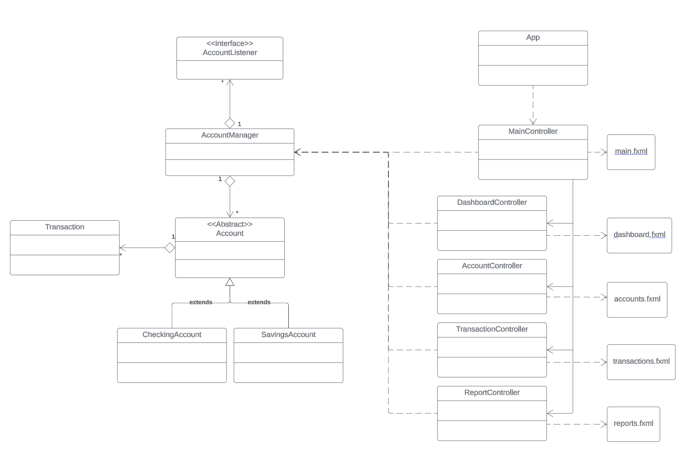

# Personal Finance Manager

## Project Description:
This application allows users to manage their personal finances by managing accounts, tracking transactions, categorizing them, and displaying summaries and reports.

## Initial UI Sketch

## Design Model (UML)

## User Guide:

### Dashboard Tab:
- See an overview of all your accounts and their balances.

### Accounts Tab:
1. **"Accounts" Section:**
    - Displays all accounts.
    - Select an account from the "Accounts" list to see account details in the "Account Details" section.
2. **"Account Details" Section:**
    - Displays details of selected account.
3. **"Create New Account" Section:**
    1. Select the type of account you would like to create.
    2. Create a name for your new account.
    3. Enter a starting balance for your account.
    4. If you are creating a savings account, enter the interest rate (ex. 0.58% -> enter 0.58).
    5. Click the "Add New Account" button. 

### Transactions Tab:
1. Select an account to view the current list of transactions.
2. To add transactions:
    1. Ensure the account you would like to add transactions to is selected.
    2. Click "Add Transactions" button.
    3. Select a .csv file with entries in the format (M/D/YYYY, Description, +/-amount).

### Reports Tab:
- Click "Generate Report" to view a financial summary of all your accounts.
- Click "Export Report" to export a financial summary of all your accounts as a .txt file.